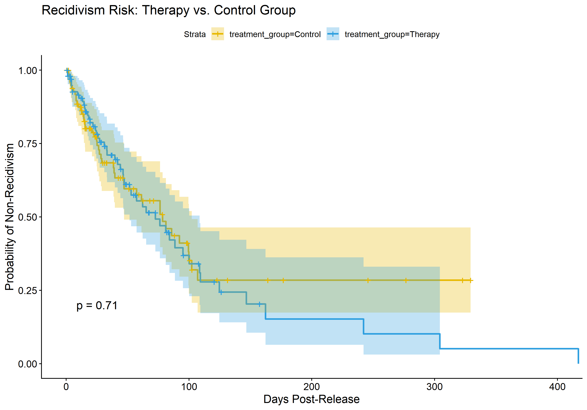

# Forensic Survival Analysis: Recidivism Risk Modeling

## Overview
This project applies **Survival Analysis (Time-to-Event modeling)** to forensic behavioral data. Using the `survival` and `survminer` packages in R, I modeled the "hazard" of criminal recidivism post-release.

## Key Analysis: Kaplan-Meier Curve
This visualization compares the non-recidivism probability between a therapy-intervention group and a control group. The "staircase" drops indicate re-offense events over time.

## Research Findings
- **Cox Proportional Hazards:** Identified significant predictors of re-offense, focusing on treatment efficacy and prior offense count.
- **Methodology:** Implemented a log-rank test to determine statistical significance between intervention groups.

## Clinical Application
Understanding the "Time-to-Failure" in forensic populations is critical for resource allocation in juvenile detention centers (like Dongri) and for developing evidence-based rehabilitation protocols.
